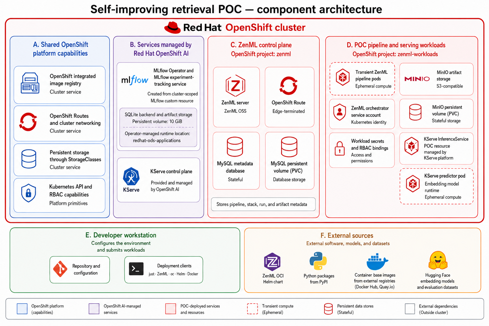
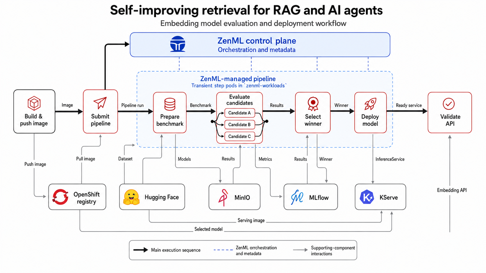
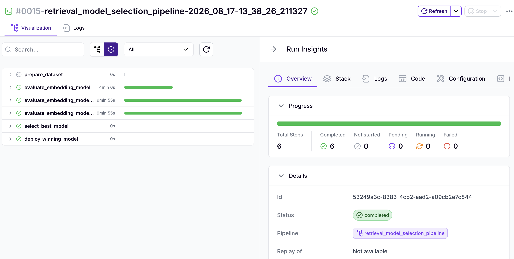
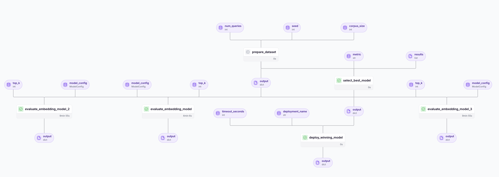

# Self-improving retrieval for RAG and AI agents

Evaluate, select, and deploy embedding models for RAG and AI-agent retrieval
workflows with ZenML on Red Hat OpenShift AI.

ZenML is an open-source MLOps framework for building portable ML workflows in
Python. Its stack abstraction separates pipeline code from the infrastructure
that executes it, allowing the same workflow to move between local and remote
orchestrators and interchangeable services for artifacts, images, and
experiment tracking. This example also uses ZenML's experimental
dynamic-pipeline API: native Python loops and conditionals construct the runtime
graph, while candidate evaluations are submitted as concurrent, isolated steps.
ZenML records the resulting runs, step states, and artifact metadata in one
observable workflow.

## Table of Contents

- [Overview](#overview)
- [Detailed description](#detailed-description)
  - [Architecture diagrams](#architecture-diagrams)
- [Requirements](#requirements)
  - [Minimum hardware requirements](#minimum-hardware-requirements)
  - [Minimum software requirements](#minimum-software-requirements)
  - [Required user permissions](#required-user-permissions)
- [Deploy](#deploy)
  - [Prerequisites](#prerequisites)
  - [Installation](#installation)
  - [Validating the deployment](#validating-the-deployment)
  - [Delete](#delete)
- [Repository structure](#repository-structure)
- [References](#references)
- [Technical details](#technical-details)
  - [Deployed infrastructure](#deployed-infrastructure)
  - [Pipeline execution](#pipeline-execution)
  - [Credential lifetime](#credential-lifetime)
  - [Production-readiness limitations](#production-readiness-limitations)
- [Tags](#tags)

## Overview

Retrieval quality determines whether RAG applications and AI agents receive
useful context before generating an answer or taking an action. This quickstart
demonstrates a repeatable improvement loop that compares embedding models,
selects the strongest candidate, and makes it available to retrieval workloads.
It is intended for teams exploring how model evaluation and deployment can be
automated on OpenShift AI.

## Detailed description

RAG systems and agents depend on retrieval to locate relevant documents,
knowledge, memories, or tool instructions. An embedding model that performs
well for one corpus might perform poorly for another, while choosing models by
reputation alone provides little evidence that retrieval is actually improving.

This quickstart presents self-improvement as a bounded, observable loop: assess
several retrieval-model candidates against a labeled benchmark, compare their
results, select the best performer, and deploy it for use by downstream
applications. The included benchmark provides a reproducible demonstration;
teams can adapt the same pattern to their own evaluated queries and documents.

The result is a working foundation for improving retrieval in RAG applications,
agent knowledge access, and semantic search. It deliberately focuses on the
retrieval component and does not include document ingestion, a vector database,
prompt orchestration, or answer generation.

### Architecture diagrams

The component view separates the shared OpenShift capabilities, OpenShift
AI-managed services, ZenML control plane, POC workloads, developer workstation,
and external software and model sources used by the example.



*High-level component architecture and deployment boundaries.*


## Requirements

Before deploying, confirm the available cluster capacity, supported platform
components, local tooling, and required OpenShift permissions described below.

### Minimum hardware requirements

The current deployment is CPU-only; no GPU is required.

**Persistent storage:**

- MySQL: `5Gi` by default.
- MinIO artifact storage: `10Gi` by default.
- OpenShift AI MLflow storage: `10Gi` by default.

**Deployed workloads with explicit resource settings:**

- MinIO: `250m` CPU and `512Mi` memory requested; `1` CPU and
  `1Gi` memory limited.
- KServe embedding model: `250m` CPU and `512Mi` memory requested;
  `2` CPU and `2Gi` memory limited.
- MySQL: `1Gi` memory limit by default.

**Pipeline execution profile:**

- At most three ZenML step pods run concurrently.
- Each step pod requests `1` CPU and `2Gi` memory and is limited to `2` CPU and
  `4Gi` memory.
- The ZenML orchestrator pod requests `250m` CPU and `512Mi` memory and is
  limited to `500m` CPU and `1Gi` memory.

One default pipeline run therefore requests at most `3.25` CPU and `6.5Gi`
memory when all three candidate evaluations run in parallel. Its configured
upper limit is `6.5` CPU and `13Gi` memory. These figures cover the pipeline
pods only; OpenShift platform overhead and the separately deployed services
must be sized in addition. Concurrent pipeline runs multiply this requirement.
The default pipeline has completed successfully with this profile on the tested
OpenShift AI environment; this is an example baseline rather than a general
capacity guarantee.

### Minimum software requirements

**Target platform versions:**

- Red Hat OpenShift AI `3.4.x`; this POC was tested with `3.4.3`.
- Red Hat OpenShift Container Platform `4.19.9+`, `4.20`, `4.21`, or `4.22`,
  following Red Hat's
  [supported OpenShift AI 3.x configurations](https://access.redhat.com/articles/rhoai-supported-configs-3.x).

The exact OpenShift Container Platform patch version used during POC validation
was not recorded. Treat the OpenShift range above as the target compatibility
range, not as a claim that this repository has been tested on every listed
release.

**Required cluster services:**

- Dynamic persistent storage and a default `StorageClass` for MySQL.
- OpenShift AI KServe and MLflow Operator components in the `Managed` state.
- The KServe `InferenceService` and OpenShift AI `MLflow` custom resources.
- The OpenShift integrated image registry in the `Managed` state.
- Storage classes for MinIO and MLflow. Both default to `gp3-csi` and can be
  changed in `deployment.env`.

**Local tools:**

- Bash and `just`.
- Python `3.11` or newer.
- `oc`, authenticated to the target OpenShift cluster.
- Helm 3.
- `curl` and `openssl`.
- A running local Docker daemon, the Docker CLI, and the Docker Python SDK.
- A ZenML client version selected from the
  [ZenML release history on PyPI](https://pypi.org/project/zenml/#history).
  The scripts deploy the matching server version automatically. This POC was
  validated with `0.96.2`; newer versions may require compatibility changes.

The client and cluster also need outbound access to the configured container
registries, the ZenML Helm chart, Python package indexes, Hugging Face model and
dataset repositories, and the OpenShift Routes created by this project.

### Required user permissions

Run the bootstrap as a cluster administrator, or as a user with an equivalent
set of permissions. The scripts need permission to:

- Create the `zenml` and `zenml-workloads` projects.
- Read storage classes, OpenShift templates, custom resource definitions, the
  `DataScienceCluster`, and cluster roles.
- Use `oc adm policy` to grant roles to the orchestrator service account.
- Create and bind namespace roles for KServe and MLflow access.
- Create a cluster-scoped OpenShift AI `MLflow` resource when one is absent.
- Patch the cluster image-registry configuration to enable its default Route.
- Create deployments, services, routes, secrets, jobs, PVCs, image streams, and
  KServe `InferenceService` resources.

The current bootstrap is not suitable for a user restricted to a single
pre-provisioned namespace.


## Deploy

Deployment proceeds in two phases: provision the ZenML server and MySQL, then
configure the remote workload stack and OpenShift AI integrations. Validation
and cleanup commands follow the installation steps.

### Prerequisites

From the repository root, create a Python environment and install the project
dependencies:

```bash
python -m venv env
source env/bin/activate
python -m pip install --upgrade pip
python -m pip install -e apps/
```

The unpinned project dependency installs the newest ZenML release compatible
with the local Python environment. To reproduce this POC with its validated
version, install it explicitly before installing the project:

```bash
python -m pip install 'zenml[server]==0.96.2'
python -m pip install -e apps/
```

`just bootstrap-stack` installs the S3 and MLflow integrations through
`zenml integration install s3 mlflow -y`. ZenML therefore controls the client
dependency sets used for the MinIO artifact store and MLflow experiment
tracking.

Confirm that `oc` is authenticated and that the local Docker daemon is
reachable:

```bash
oc whoami
docker info
```

The scripts use the interpreter configured by `ZENML_PYTHON`. Set it in the
deployment configuration if `python` does not resolve to the environment
created above.

### Installation

Deployment has two phases because the ZenML server must be activated and the
local CLI authenticated before the remote stack can be registered.

1. Copy and protect the deployment configuration:

   ```bash
   cp deployment.env.example deployment.env
   chmod 600 deployment.env
   ```

   Review the namespace names, storage classes, storage sizes, and token
   durations. The scripts treat this file as trusted input and load it as shell
   configuration.

2. Deploy the ZenML server and its persistent MySQL database:

   ```bash
   just bootstrap-server
   ```

3. Open the ZenML Route printed by the command and complete the initial browser
   activation. Then authenticate the local ZenML CLI:

   ```bash
   zenml login https://ZENML_ROUTE
   zenml status
   ```

4. With the local Docker daemon running, deploy and register the remote
   OpenShift workload stack:

   ```bash
   just bootstrap-stack
   ```

To use a configuration other than `deployment.env`, pass it to any recipe
through `DEPLOYMENT_ENV`:

```bash
DEPLOYMENT_ENV=deployment.lab.env just bootstrap-server
```

### Validating the deployment

First, validate both infrastructure deployment phases:

```bash
just validate
```

The validation checks the server, routes, persistent storage, workload
permissions, registry access, Docker connectivity, OpenShift AI components, and
ZenML registrations without intentionally modifying them.

Then execute the example pipeline:

```bash
just run-pipeline
```

The command refreshes the short-lived stack credentials, builds and pushes the
pipeline image, and submits the run to the OpenShift-backed ZenML stack. The
pipeline evaluates its configured embedding candidates, records the experiment
in MLflow, selects a winner, and deploys it as a KServe `InferenceService`. The
command waits for the pipeline to complete and for the model deployment to
become ready.

Finally, validate the selected model:

```bash
just validate-model
```

This checks that the `InferenceService` is ready, forwards a local port directly
to its predictor pod, calls the `/health` and `/embed` endpoints, and verifies
that the response contains a numeric embedding from the deployed model.

Individual checks and operational commands are also available:

| Command | Result |
| --- | --- |
| `just validate-server` | Validates the ZenML server and MySQL deployment |
| `just validate-stack` | Validates OpenShift resources and ZenML stack registrations |
| `just refresh-stack-credentials` | Renews Kubernetes, registry, and MLflow credentials |
| `just run-pipeline` | Refreshes credentials and submits the pipeline |
| `just validate-model` | Checks the KServe deployment and calls its embedding API |

### Delete

Remove the remote stack before the server so that the teardown can still
authenticate to ZenML and delete its component registrations:

```bash
just delete
```

Deletion requires explicit confirmation. It removes the dedicated workload
project, including MinIO artifacts, pipeline images, and its PVC, and then
removes the ZenML server, MySQL database, and their PVCs.

The shared cluster-scoped MLflow instance and the integrated registry's default
Route are intentionally retained and must be reviewed separately.

The phases can also be removed individually, in this order:

```bash
just delete-stack
just delete-server
```


## Repository structure

```
.
├── apps/
│   ├── pyproject.toml        # Python package and dependency metadata
│   ├── .dockerignore         # Docker build exclusions for pipeline images
│   └── retrieval_poc/        # Pipeline, evaluation, deployment, and serving code
│       ├── pipeline.py       # Dynamic ZenML pipeline and runtime settings
│       ├── steps.py          # Dataset, evaluation, and selection steps
│       ├── deployment.py     # KServe InferenceService deployment step
│       ├── server.py         # Embedding model HTTP server
│       └── __main__.py       # Pipeline entry point (`python -m apps.retrieval_poc`)
├── deploy/
│   ├── helm/
│   │   └── openshift-values.yaml  # Values for the official ZenML Helm chart
│   └── openshift/                 # Parameterized OpenShift resource templates
├── scripts/                  # Bootstrap, validation, refresh, and deletion scripts
├── docs/images/              # Architecture diagrams and screenshots
├── deployment.env.example    # Deployment and stack configuration example
├── justfile                  # User-facing deployment and operation commands
└── README.md
```

The ZenML server is installed from ZenML's published OCI Helm chart; the
remaining OpenShift resources are rendered from `deploy/openshift/` and applied
by the bootstrap scripts.

## References

- [ZenML documentation](https://docs.zenml.io/)
- [ZenML releases on PyPI](https://pypi.org/project/zenml/#history)
- [Red Hat OpenShift AI Self-Managed 3.4 documentation](https://docs.redhat.com/en/documentation/red_hat_openshift_ai_self-managed/3.4)
- [Red Hat OpenShift AI 3.x supported configurations](https://access.redhat.com/articles/rhoai-supported-configs-3.x)
- [KServe documentation](https://kserve.github.io/website/)
- [MLflow documentation](https://www.mlflow.org/docs/latest/)
- [BEIR SciFact dataset on Hugging Face](https://huggingface.co/datasets/BeIR/scifact)
- [BEIR benchmark paper](https://arxiv.org/abs/2104.08663)
- [SciFact paper](https://arxiv.org/abs/2004.14974)

## Technical details

### Deployed infrastructure

The scripts provision the infrastructure in two phases.

**ZenML server project (`zenml` by default):**

- The selected ZenML OSS version, installed from the official ZenML OCI Helm
  chart. Version `0.96.2` is the reference version used to validate this POC.
- A persistent MySQL database created from OpenShift's
  `openshift/mysql-persistent` template.
- Database credential Secrets and a `5Gi` PVC by default.
- An edge-terminated OpenShift Route for the ZenML server.

**Remote workload project (`zenml-workloads` by default):**

| ZenML component | Implementation |
| --- | --- |
| Orchestrator | Kubernetes workloads running under a dedicated service account |
| Artifact store | Single-replica MinIO with a persistent bucket |
| Container registry | OpenShift integrated image registry |
| Image builder | Local Docker builder on the client machine |
| Experiment tracker | OpenShift AI MLflow |
| Model serving | OpenShift AI KServe |

The remote-stack bootstrap creates the service account and required RBAC,
smoke-tests the MinIO bucket, enables and authenticates to the integrated
registry Route, and registers the components as the active ZenML stack.

MLflow is cluster-scoped. An existing configured instance is reused; otherwise,
the script creates a single-replica instance backed by SQLite and a `10Gi`
PVC. The KServe `InferenceService` is created later by the pipeline rather
than during infrastructure bootstrap.

### Pipeline execution

The example implements a compact evaluate-select-deploy loop for an embedding
model used by a retrieval system:



*How the pipeline uses ZenML, OpenShift AI, and the supporting services.*

1. Prepare a reproducible retrieval benchmark.
2. Evaluate the configured embedding candidates in parallel on OpenShift.
3. Store pipeline artifacts in MinIO and experiment results in MLflow.
4. Select the strongest candidate according to the pipeline's retrieval-quality
   criterion.
5. Create or update a CPU-based KServe `InferenceService` for the selected
   model and wait until it is ready.

The deployed service exposes `/health` for readiness checks and `/embed` for
query or document embeddings. This POC demonstrates automated improvement of a
retrieval component; it does not implement a complete RAG application, vector
database, or generative model.

The ZenML UI exposes both a run timeline and the underlying step graph. In the
reference run below, the three candidate evaluations execute independently
before their results converge on model selection and deployment.



*Completed pipeline run with parallel candidate evaluations.*



*Pipeline graph for benchmark preparation, candidate evaluation, model
selection, and deployment.*

### Credential lifetime

The Kubernetes connector, registry pull secret, and MLflow tracking token use
OpenShift service-account tokens. Their requested lifetime defaults to 24 hours,
with a five-minute expiry safety window for the Kubernetes connector.

`just run-pipeline` refreshes these credentials before submission. They can be
renewed independently with:

```bash
just refresh-stack-credentials
```

Refresh requires authenticated `oc` and ZenML CLI sessions and a reachable
local Docker daemon.

### Production-readiness limitations

> [!WARNING]
> This deployment is a proof of concept. It is intended for isolated
> development and demonstration environments, not production use.

Current limitations include:

- ZenML, MySQL, MinIO, MLflow, and model serving are not configured for high
  availability or multi-zone failure tolerance.
- MinIO and MLflow are single-replica deployments; MLflow uses SQLite and local
  persistent-volume storage.
- Local shell scripts create and rotate secrets and short-lived tokens. There
  is no external secret manager or in-cluster credential rotation.
- The integrated image registry's default Route is enabled cluster-wide.
- This repository does not install network policies or manage Route
  certificates and external identity-provider integration.
- Quotas, autoscaling, pod disruption budgets, capacity testing, monitoring,
  alerting, and backup and restore procedures are not provided.

A production adaptation should use supported highly available stateful
services, managed secrets, least-privilege bootstrap identities, restricted
network exposure, and defined backup, observability, upgrade, and recovery
procedures.


## Tags

- **Title:** Self-improving retrieval for RAG and AI agents
- **Description:** Evaluate, select, and deploy embedding models for RAG and AI-agent retrieval workflows with ZenML on Red Hat OpenShift AI.
- **Industry:** Cross-industry
- **Product:** OpenShift AI
- **Use case:** RAG, MLOps, automation
- **Partner:** N/A
- **Contributor org:** Red Hat
