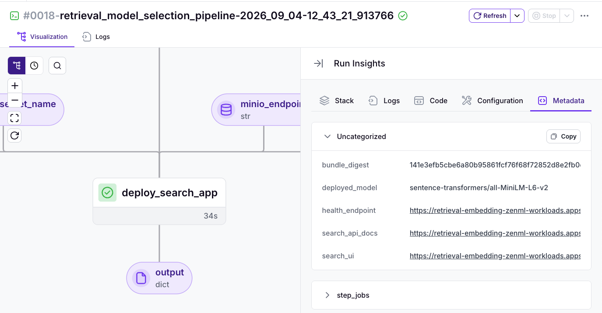
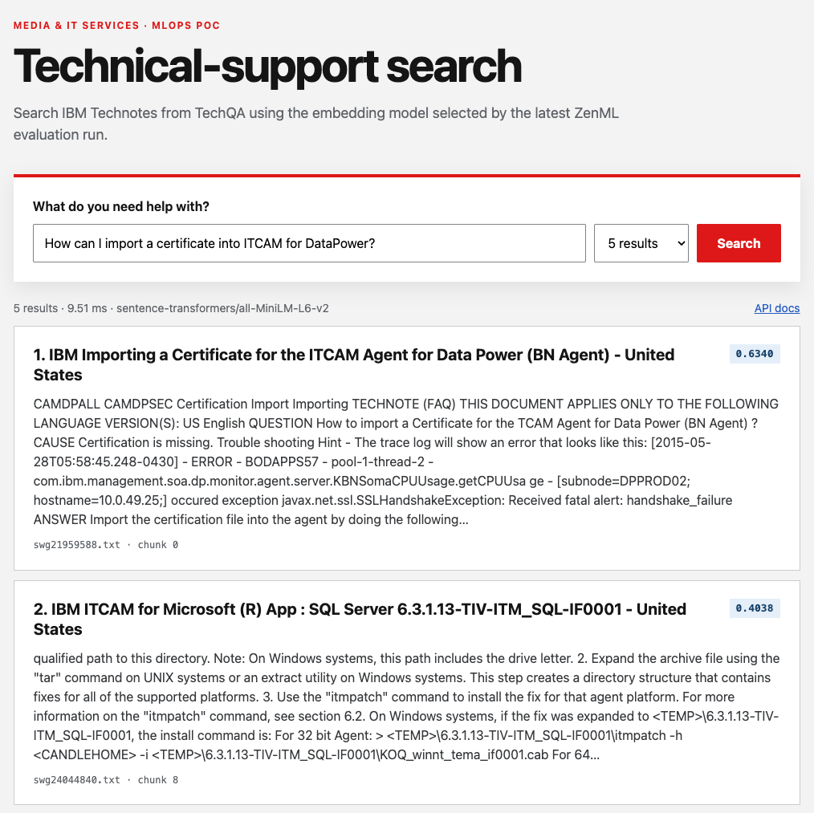

# TechQA retrieval pipeline and search application

This package implements the application layer of the quickstart. A ZenML
pipeline evaluates embedding models on TechQA, selects the strongest candidate,
builds a FAISS index with that winner, and deploys a searchable FastAPI UI to
OpenShift AI KServe.

It is a retrieval POC rather than a full RAG stack: there is no generative model
or answer synthesis. Users search technical-support documents and receive
ranked titles, matching text snippets, and similarity scores.

## Layout

```
apps/
├── pyproject.toml
├── tests/test_retrieval.py
└── retrieval_poc/
    ├── __main__.py                 # Environment-to-pipeline entry point
    ├── config.py                   # Candidate model definitions
    ├── pipeline/
    │   ├── definition.py           # Dynamic pipeline and image settings
    │   └── steps.py                # ZenML-decorated workflow steps
    ├── retrieval/
    │   ├── dataset.py              # TechQA loading and deterministic subset
    │   ├── chunking.py             # Shared title-plus-body chunks
    │   ├── evaluation.py           # Document-level IR metrics
    │   └── indexing.py             # FAISS bundle build/load contract
    ├── infrastructure/
    │   ├── bundle_store.py         # Versioned bundle persistence in MinIO
    │   └── kserve.py               # InferenceService and Route adapter
    └── search_app/
        ├── app.py                  # FastAPI endpoints and UI hosting
        ├── engine.py               # SentenceTransformer + FAISS runtime
        ├── schemas.py              # API contracts
        └── static/                 # HTML, CSS, and browser JavaScript
```

The dependency direction is deliberate: pipeline steps orchestrate pure
retrieval and infrastructure adapters; the search app imports only retrieval
contracts. Retrieval code does not import FastAPI, and the serving application
does not import ZenML.

## Pipeline flow

1. Load answerable TechQA development questions and a reproducible IBM
   Technote corpus.
2. Split each document into deterministic overlapping word chunks, prepending
   the document title to every chunk.
3. Evaluate three candidate models concurrently. Chunk scores are collapsed by
   document before nDCG@10, Recall@K, Precision@10, MRR@10, and MAP@10 are
   calculated.
4. Select the best model by `ndcg_at_10`.
5. Re-encode the shared chunks with the winner and build a normalized
   `faiss.IndexFlatIP` index.
6. Store a content-addressed ZIP bundle (`index.faiss`, `chunks.json`, and
   `manifest.json`) in the active MinIO artifact store.
7. Deploy the same generated pipeline image to KServe. An init container copies
   the selected bundle from MinIO, and an OpenShift Route exposes the UI.

Run it from the repository root:

```bash
just run-pipeline
```

For a fast end-to-end validation, use the smoke profile:

```bash
just run-pipeline --smoke
```

The smoke profile evaluates 20 queries against 40 documents with `top_k=20`.
With the current TechQA seed and chunking defaults, this produces 110 searchable
chunks, or two corpus-encoding batches per candidate. It intentionally overrides
`NUM_QUERIES`, `CORPUS_SIZE`, and `TOP_K`; omit `--smoke` for the configured/full
benchmark. The equivalent Make command is
`make run-pipeline PIPELINE_ARGS=--smoke`.

The final deployment step adds clickable `search_ui`, `search_api_docs`, and
`health_endpoint` links to both the step and pipeline-run metadata in ZenML.
To open the application, view the completed run, select `deploy_search_app`,
open **Run Insights → Metadata**, and click `search_ui`. `just validate-model`
provides a second path: it checks the deployment and prints the public URL.



## Container dependencies

There is no committed Dockerfile. ZenML generates and pushes the image using
the settings in `pipeline/definition.py`. `apps/pyproject.toml` is the single
dependency source for both local installation and the generated image. It
includes Sentence Transformers, CPU PyTorch, FAISS, FastAPI, Kubernetes, and
the ZenML integrations used for MLflow and S3/MinIO.

ZenML exports the project dependencies with `uv pip compile` for the reference
x86_64 manylinux target and explicitly selects the CPU PyTorch backend. This
prevents CUDA-only transitive packages from entering the generated image.

The project itself is installed with:

```text
uv pip install --no-deps ./apps
```

This makes the static UI and `apps.retrieval_poc.search_app` importable when
KServe starts Uvicorn directly. The entry point sets the repository source root
before importing the decorated pipeline so ZenML preserves the package layout.

## Search API and UI

The Route root (`/`) is the browser UI. The service also exposes:



| Endpoint | Purpose |
| --- | --- |
| `GET /health` | Model, bundle, document, and chunk readiness |
| `POST /search` | Ranked document titles, snippets, and cosine scores |
| `POST /embed` | Normalized query/document/raw embeddings |
| `GET /docs` | Interactive OpenAPI documentation |

Example request:

```bash
curl -sS -H 'Content-Type: application/json' \
  -d '{"query":"How do I troubleshoot a failed database connection?","top_k":5}' \
  https://<search-route>/search
```

`just validate-model` checks the InferenceService, admitted Route, HTML UI,
search response shape, and embedding endpoint through a local port-forward.

## Configuration

| Variable | Default | Description |
| --- | --- | --- |
| `NUM_QUERIES` | `160` | Benchmark query count |
| `CORPUS_SIZE` | `500` | Maximum Technote corpus size (496 available) |
| `TOP_K` | `50` | Document retrieval depth for evaluation |
| `SEED` | `42` | Deterministic subset seed |
| `QUERY_SPLIT` | `DEV` | `TRAIN`, `DEV`, or `ALL` |
| `CHUNK_SIZE_WORDS` | `240` | Words per indexed passage |
| `CHUNK_OVERLAP_WORDS` | `40` | Words repeated between passages |
| `MODEL_SERVING_NAME` | `retrieval-embedding` | InferenceService name |
| `MODEL_SERVING_ROUTE` | `retrieval-embedding-ui` | OpenShift Route for the search UI |
| `MODEL_SERVING_TIMEOUT` | `600` | Readiness timeout in seconds |

MinIO image and Secret names are read from the existing deployment environment.
The in-cluster MinIO endpoint defaults to `http://minio:9000`.

## Local checks

Install application and test dependencies, then run the small pure-logic suite:

```bash
python -m venv env
source env/bin/activate
pip install -e 'apps[dev]'
python -m pytest -q apps/tests/test_retrieval.py
```

Submitting or validating the remote deployment still requires an authenticated
ZenML server and the bootstrapped OpenShift stack described in the root README.
